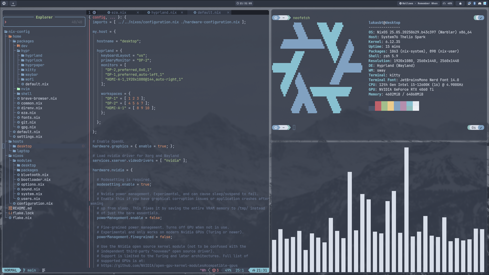

# My nix configurations



## 🔐 Secrets Setup

Before building on a new host, you must provision the **Age Decryption Key**.

1.  **Create the directory:**
    ```bash
    sudo mkdir -p /var/lib/sops-nix
    ```

2.  **Add the key:**
    Paste your `AGE-SECRET-KEY-...` into `/var/lib/sops-nix/key.txt`

3.  **Secure it:**
    ```bash
    sudo chmod 600 /var/lib/sops-nix/key.txt
    ```

*Without this key, `nixos-rebuild switch` will fail during activation.*
